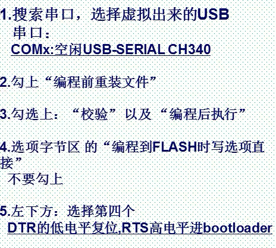
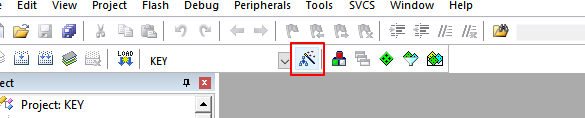
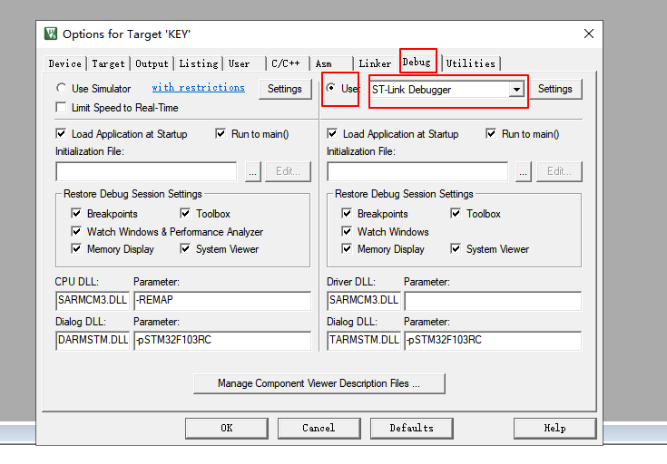
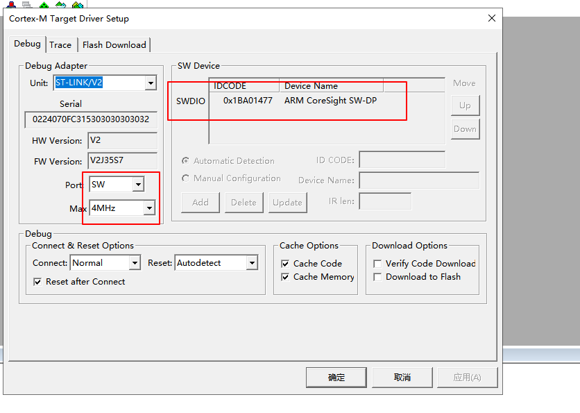
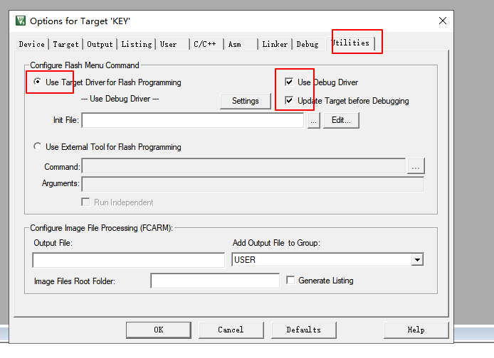

# 初级

## 软件环境搭建

### MDK安装

1. 请点击：mdk_xxx.exe，安装MDK软件【忽略版本号，x以实际文件内容为准】
2. 请点击：Keil.STM32FXxx_DFP.x.x.x.pack，安装芯片支持包【忽略版本号，x以实际文件内容为准】

**说明：**MDK5 以后对于每种芯片进行数据包支持的方式，需要单独安装www.keil.com/dd2/pack/

**说明：**MDK软件试用版本可以公开下载，且无需付费，所以我们下载了试用版本存放在光盘供大家试用，MDK软件版权属于ARM公司，其他试用版本均可在Keil官网下载：http://www.keil.com/download/product

上面提供的MDK软件是试用版本，只能编译32K程序，超过32K程序需要注册。未注册软件编译程序会提示错误信息。由于MDK版权属于ARM公司，非学习研究用途，请咨询ARM官方获取相关许可证

#### 破解

https://www.jb51.net/softs/781873.html

###  USB串口驱动安装

安装后如果出现`预处理安装成功`,可以链接板子，让系统自己识别安装

### JLINK安装

## 硬件链接

### 环境准备 CH340驱动

### FlyMcu下载软件（免安装板）

### FlyMcu 下载 - 配置信息



## STLINK程序下载

### 环境配置

1. ST驱动安装
2. MDK软件安装

### MDK配置

1. 点击

   

2. 配置信息

   

   **点击settings**

   

   

## 新建STM32工程模板 - 固件

## 新建STM32工程模板 - 寄存器

## GPIO工作原理

## 跑马灯

### 跑马灯 - 库函数

1. 编写LED初始化程序`led.c`

   ```c
   #include "led.h"
   #include "stm32f10x.h"
   
   void LED_Init(void)
   {
   	GPIO_InitTypeDef GPIO_InitStructure;
   	
   	
   	
   	RCC_APB2PeriphClockCmd(RCC_APB2Periph_GPIOA,ENABLE); // GPIOA
   	RCC_APB2PeriphClockCmd(RCC_APB2Periph_GPIOD,ENABLE); // GPIOD
   	
   	// GPIOA初始化 
   	GPIO_InitStructure.GPIO_Mode = GPIO_Mode_Out_PP;
   	GPIO_InitStructure.GPIO_Pin = GPIO_Pin_8;
   	GPIO_InitStructure.GPIO_Speed = GPIO_Speed_50MHz;
   	GPIO_Init(GPIOA,&GPIO_InitStructure);
   	// 设置为高电平 - 不点亮
   	GPIO_SetBits(GPIOA,GPIO_Pin_8);
   	
   	// GPIOD初始化 
   	GPIO_InitStructure.GPIO_Mode = GPIO_Mode_Out_PP;
   	GPIO_InitStructure.GPIO_Pin = GPIO_Pin_2;
   	GPIO_InitStructure.GPIO_Speed = GPIO_Speed_50MHz;
   	GPIO_Init(GPIOD,&GPIO_InitStructure);
   	// 设置为高电平 - 不点亮
   	GPIO_SetBits(GPIOD,GPIO_Pin_2);
    }
   ```

### 跑马灯 - 寄存器

### 跑马灯 - 位操作

## PGIO作输入

## 时钟系统

## 在线软件调试

## 端口复用

## 端口重映射

## NVIC中断优先级管理

## 串口通信原理UART

## 外部中断

## 独立看门狗

  ## 窗口看门狗