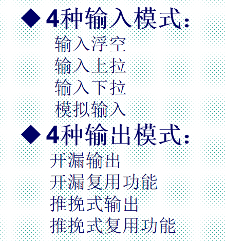

# 初级

## 软件环境搭建

### MDK安装

1. 请点击：mdk_xxx.exe，安装MDK软件【忽略版本号，x以实际文件内容为准】
2. 请点击：Keil.STM32FXxx_DFP.x.x.x.pack，安装芯片支持包【忽略版本号，x以实际文件内容为准】

**说明：**MDK5 以后对于每种芯片进行数据包支持的方式，需要单独安装www.keil.com/dd2/pack/

**说明：**MDK软件试用版本可以公开下载，且无需付费，所以我们下载了试用版本存放在光盘供大家试用，MDK软件版权属于ARM公司，其他试用版本均可在Keil官网下载：http://www.keil.com/download/product

上面提供的MDK软件是试用版本，只能编译32K程序，超过32K程序需要注册。未注册软件编译程序会提示错误信息。由于MDK版权属于ARM公司，非学习研究用途，请咨询ARM官方获取相关许可证

#### 破解

https://www.jb51.net/softs/781873.html

###  USB串口驱动安装

安装后如果出现`预处理安装成功`,可以链接板子，让系统自己识别安装

### JLINK安装

## 硬件链接

### 环境准备 CH340驱动

### FlyMcu下载软件（免安装板）

### FlyMcu 下载 - 配置信息


## STLINK程序下载

### 环境配置

1. ST驱动安装
2. MDK软件安装

### MDK配置

1. 点击

   

2. 配置信息

   

   **点击settings**

   

   

## 新建STM32工程模板 - 固件

## 新建STM32工程模板 - 寄存器

## GPIO工作原理




### GPIO的输入工作模式1—输入浮空模式


### GPIO的输入工作模式2—输入上拉模式


### GPIO的输入工作模式3—输入下拉模式


### GPIO的输入工作模式4—模拟模式


### GPIO的输出工作模式1—开漏输出模式


### GPIO的输出工作模式2—开漏复用输出模式


### GPIO的输出工作模式3—推挽输出模式


### GPIO的输出工作模式4—推挽复用输出模式


## 跑马灯

### GPIO函数库介绍

1. 初始化函数

   ```shell
   void GPIO_Init(GPIO_TypeDef* GPIOx, GPIO_InitTypeDef* GPIO_InitStruct);
   ```

2. 读取输入电平函数

   ```shell
   uint8_t GPIO_ReadInputDataBit(GPIO_TypeDef* GPIOx, uint16_t GPIO_Pin);
   uint16_t GPIO_ReadInputData(GPIO_TypeDef* GPIOx);
   ```

3. 读取输出电平函数

   ```shell
   uint8_t GPIO_ReadOutputDataBit(GPIO_TypeDef* GPIOx, uint16_t GPIO_Pin);
   uint16_t GPIO_ReadOutputData(GPIO_TypeDef* GPIOx);
   ```

4. 设置输出电平函数

   ```shell
   void GPIO_SetBits(GPIO_TypeDef* GPIOx, uint16_t GPIO_Pin);
   void GPIO_ResetBits(GPIO_TypeDef* GPIOx, uint16_t GPIO_Pin);
   void GPIO_WriteBit(GPIO_TypeDef* GPIOx, uint16_t GPIO_Pin, BitAction BitVal);
   void GPIO_Write(GPIO_TypeDef* GPIOx, uint16_t PortVal);
   ```

**在初始化GPIO口之前需要使能IO口时钟**

> RCC_APB2PeriphColckCmd()

1. 编写LED初始化程序`led.c`

   ```c
   #include "led.h"
   #include "stm32f10x.h"
   
   void LED_Init(void)
   {
   	GPIO_InitTypeDef GPIO_InitStructure;
   	
   	
   	
   	RCC_APB2PeriphClockCmd(RCC_APB2Periph_GPIOA,ENABLE); // GPIOA
   	RCC_APB2PeriphClockCmd(RCC_APB2Periph_GPIOD,ENABLE); // GPIOD
   	
   	// GPIOA初始化 
   	GPIO_InitStructure.GPIO_Mode = GPIO_Mode_Out_PP;
   	GPIO_InitStructure.GPIO_Pin = GPIO_Pin_8;
   	GPIO_InitStructure.GPIO_Speed = GPIO_Speed_50MHz;
   	GPIO_Init(GPIOA,&GPIO_InitStructure);
   	// 设置为高电平 - 不点亮
   	GPIO_SetBits(GPIOA,GPIO_Pin_8);
   	
   	// GPIOD初始化 
   	GPIO_InitStructure.GPIO_Mode = GPIO_Mode_Out_PP;
   	GPIO_InitStructure.GPIO_Pin = GPIO_Pin_2;
   	GPIO_InitStructure.GPIO_Speed = GPIO_Speed_50MHz;
   	GPIO_Init(GPIOD,&GPIO_InitStructure);
   	// 设置为高电平 - 不点亮
   	GPIO_SetBits(GPIOD,GPIO_Pin_2);
    }
   ```

2. 主函数调动

   ```c
   #include "stm32f10x.h"
   #include "delay.h"
   #include "led.h"
   
   
   
   int main(void)
   {
   	delay_init();
   	LED_Init();
   	
   	while(1) {
   		GPIO_SetBits(GPIOA,GPIO_Pin_8);
   		GPIO_ResetBits(GPIOD,GPIO_Pin_2);
   		delay_ms(500);
   		
   		GPIO_ResetBits(GPIOA,GPIO_Pin_8);
   		GPIO_SetBits(GPIOD,GPIO_Pin_2);
   		delay_ms(500);
   		
   	}
   }
   ```


## PGIO作输入

按键扫描(支持连续按和非连续按操作)

```c
 u8 KEY_Scan(u8 mode)
    {
     static u8 key_up=1;
     if(mode==1) key_up=1;//支持连续按
      if（key_up &&  KEY按下）
      {
        delay_ms(10);//延时，防抖
        key_up=0;//标记这次key已经按下
        if(KEY确实按下)
          {
           return KEY_VALUE;
          }
        }else if(KEY没有按下)  key_up=1;
       return 没有按下
    }
```

> key.c

```c
#include "stm32f10x.h"
#include "key.h"
#include "delay.h"

// KEY初始化
void KEY_Init(void) {
	
	GPIO_InitTypeDef GPIO_InitTypeDefStruct;
	
	// GPIOA使能时钟
	RCC_APB2PeriphClockCmd(RCC_APB2Periph_GPIOA, ENABLE);
	// GPIOC使能时钟
	RCC_APB2PeriphClockCmd(RCC_APB2Periph_GPIOC, ENABLE);
	
	// 初始化 GPIOC_5  KEY0
	GPIO_InitTypeDefStruct.GPIO_Mode = GPIO_Mode_IPU;
	GPIO_InitTypeDefStruct.GPIO_Pin = GPIO_Pin_5;
	GPIO_InitTypeDefStruct.GPIO_Speed = GPIO_Speed_50MHz;
	GPIO_Init(GPIOC, &GPIO_InitTypeDefStruct);
	
	// 初始化 GPIOA_15  KEY1
	GPIO_InitTypeDefStruct.GPIO_Mode = GPIO_Mode_IPU;
	GPIO_InitTypeDefStruct.GPIO_Pin = GPIO_Pin_15;
	GPIO_InitTypeDefStruct.GPIO_Speed = GPIO_Speed_50MHz;
	GPIO_Init(GPIOA, &GPIO_InitTypeDefStruct);
	
	// 初始化 GPIOA_0  WK_UP
	GPIO_InitTypeDefStruct.GPIO_Mode = GPIO_Mode_IPD;
	GPIO_InitTypeDefStruct.GPIO_Pin = GPIO_Pin_0;
	GPIO_InitTypeDefStruct.GPIO_Speed = GPIO_Speed_50MHz;
	GPIO_Init(GPIOA, &GPIO_InitTypeDefStruct);
}

// 获取按下的按键
// 0 代表KEY0按下， 1 代表KEY1 按下， 3 代表WK_UP按下 - 1代表未按下
// mode 0 不支持连续按 1 支持连续按
char KEY_Scan(char mode){
	
	static char key_up = 1; // 按键松开标识位
	
	if(mode) { // 支持长按
		key_up = 1;
	}
	
	// 有按键按下
	if(	key_up && (!GPIO_ReadInputDataBit(GPIOC,GPIO_Pin_5)  || 
			!GPIO_ReadInputDataBit(GPIOA,GPIO_Pin_15) || 
			GPIO_ReadInputDataBit(GPIOA,GPIO_Pin_0))){
				
				delay_ms(10); // 消抖
				key_up = 0; // 按下
				if(!GPIO_ReadInputDataBit(GPIOC,GPIO_Pin_5)) return 0;
				if(!GPIO_ReadInputDataBit(GPIOA,GPIO_Pin_15)) return 1;
				if(GPIO_ReadInputDataBit(GPIOA,GPIO_Pin_0)) return 2;
	}else if(	key_up && 
						GPIO_ReadInputDataBit(GPIOC,GPIO_Pin_5) && 
						GPIO_ReadInputDataBit(GPIOA,GPIO_Pin_15) && 
						!GPIO_ReadInputDataBit(GPIOA,GPIO_Pin_0)){
						key_up = 1;
	}			
		
		return -1; // 无按键按下
}
```

> 主函数调用

```c
#include "stm32f10x.h"
#include "delay.h"
#include "led.h"
#include "key.h"

char KEY_Press = -1; // 0 代表KEY0按下， 1 代表KEY1 按下， 3 代表WK_UP按下 - 1代表未按下

int main(void)
{
	delay_init();
	LED_Init();
	KEY_Init();
	while(1) {
		KEY_Press = KEY_Scan(1); // 只有支持长按才能点亮LED
		switch(KEY_Press) {
			case 0:
					GPIO_ResetBits(GPIOA,GPIO_Pin_8);
					GPIO_SetBits(GPIOD,GPIO_Pin_2);
				break;
			case 1:
					GPIO_SetBits(GPIOA,GPIO_Pin_8);
					GPIO_ResetBits(GPIOD,GPIO_Pin_2);
				break;
			case 2:
					GPIO_ResetBits(GPIOA,GPIO_Pin_8);
					GPIO_ResetBits(GPIOD,GPIO_Pin_2);
				break;
			default:
					GPIO_SetBits(GPIOA,GPIO_Pin_8);
					GPIO_SetBits(GPIOD,GPIO_Pin_2);
			break;
		}
	}
}
```

## 时钟系统


1. STM32 有5个时钟源:HSI、HSE、LSI、LSE、PLL

   1. HSI是高速内部时钟，RC振荡器，频率为8MHz，精度不高
   2. HSE是高速外部时钟，可接石英/陶瓷谐振器，或者接外部时钟源，频率范围为4MHz~16MHz

   3. LSI是低速内部时钟，RC振荡器，频率为40kHz，提供低功耗时钟。WDG
   4. LSE是低速外部时钟，接频率为32.768kHz的石英晶体。RTC
   5. PLL为锁相环倍频输出，其时钟输入源可选择为HSI/2、HSE或者HSE/2。倍频可选择为2~16倍，但是其输出频率最大不得超过72MHz。

2. 系统时钟SYSCLK可来源于三个时钟源

   1. HSI振荡器时钟
   2. HSE振荡器时钟
   3. PLL时钟

3. STM32可以选择一个时钟信号输出到MCO脚(PA8)上，可以选择为PLL 输出的2分频、HSI、HSE、或者系统时钟

4. 任何一个外设在使用之前，必须首先使能其相应的时钟

> 几个重要的时钟

1. SYSCLK(系统时钟) 
2. AHB总线时钟
3. APB1总线时钟(低速): 速度最高36MHz
4. APB2总线时钟(高速): 速度最高72MHz
5. PLL时钟

http://www.openedv.com/posts/list/302.htm

### 相关配置寄存器

```c
typedef struct
{
  __IO uint32_t CR;                //HSI,HSE,CSS,PLL等的使能和就绪标志位 
  __IO uint32_t CFGR;           //PLL等的时钟源选择，分频系数设定
  __IO uint32_t CIR;               // 清除/使能 时钟就绪中断
  __IO uint32_t APB2RSTR;  //APB2线上外设复位寄存器
  __IO uint32_t APB1RSTR;   //APB1线上外设复位寄存器
  __IO uint32_t AHBENR;    //DMA，SDIO等时钟使能
  __IO uint32_t APB2ENR;   //APB2线上外设时钟使能
  __IO uint32_t APB1ENR;   //APB1线上外设时钟使能
  __IO uint32_t BDCR;        //备份域控制寄存器
  __IO uint32_t CSR;           //控制状态寄存器
} RCC_TypeDef;
```

### RCC相关头文件和固件库源文件


#### 头文件

`stm32f10x_rcc.h`

#### 源文件

`stm32f10x_rcc.c`


## 在线软件调试

## 端口复用

## 端口重映射

## NVIC中断优先级管理

## 串口通信原理UART

## 外部中断

## 独立看门狗

  ## 窗口看门狗

