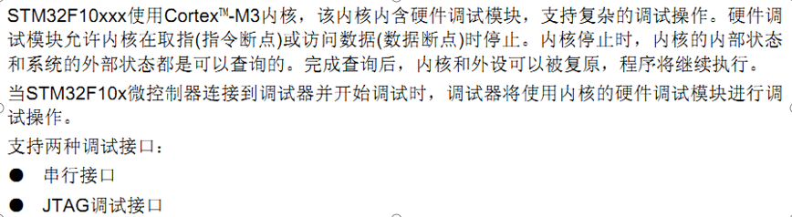

# 初级

## 软件环境搭建

### MDK安装

1. 请点击：mdk_xxx.exe，安装MDK软件【忽略版本号，x以实际文件内容为准】
2. 请点击：Keil.STM32FXxx_DFP.x.x.x.pack，安装芯片支持包【忽略版本号，x以实际文件内容为准】

**说明：**MDK5 以后对于每种芯片进行数据包支持的方式，需要单独安装www.keil.com/dd2/pack/

**说明：**MDK软件试用版本可以公开下载，且无需付费，所以我们下载了试用版本存放在光盘供大家试用，MDK软件版权属于ARM公司，其他试用版本均可在Keil官网下载：http://www.keil.com/download/product

上面提供的MDK软件是试用版本，只能编译32K程序，超过32K程序需要注册。未注册软件编译程序会提示错误信息。由于MDK版权属于ARM公司，非学习研究用途，请咨询ARM官方获取相关许可证

#### 破解

https://www.jb51.net/softs/781873.html

###  USB串口驱动安装

安装后如果出现`预处理安装成功`,可以链接板子，让系统自己识别安装

### JLINK安装

## 硬件链接

### 环境准备 CH340驱动

### FlyMcu下载软件（免安装板）

### FlyMcu 下载 - 配置信息


## STLINK程序下载

### 环境配置

1. ST驱动安装
2. MDK软件安装

### MDK配置

1. 点击

   

2. 配置信息

   

   **点击settings**

   

   

## 新建STM32工程模板 - 固件

## 新建STM32工程模板 - 寄存器

## GPIO工作原理


### GPIO的输入工作模式1—输入浮空模式


### GPIO的输入工作模式2—输入上拉模式


### GPIO的输入工作模式3—输入下拉模式


### GPIO的输入工作模式4—模拟模式


### GPIO的输出工作模式1—开漏输出模式


### GPIO的输出工作模式2—开漏复用输出模式


### GPIO的输出工作模式3—推挽输出模式


### GPIO的输出工作模式4—推挽复用输出模式


## 跑马灯

### GPIO函数库介绍

1. 初始化函数

   ```shell
   void GPIO_Init(GPIO_TypeDef* GPIOx, GPIO_InitTypeDef* GPIO_InitStruct);
   ```

2. 读取输入电平函数

   ```shell
   uint8_t GPIO_ReadInputDataBit(GPIO_TypeDef* GPIOx, uint16_t GPIO_Pin);
   uint16_t GPIO_ReadInputData(GPIO_TypeDef* GPIOx);
   ```

3. 读取输出电平函数

   ```shell
   uint8_t GPIO_ReadOutputDataBit(GPIO_TypeDef* GPIOx, uint16_t GPIO_Pin);
   uint16_t GPIO_ReadOutputData(GPIO_TypeDef* GPIOx);
   ```

4. 设置输出电平函数

   ```shell
   void GPIO_SetBits(GPIO_TypeDef* GPIOx, uint16_t GPIO_Pin);
   void GPIO_ResetBits(GPIO_TypeDef* GPIOx, uint16_t GPIO_Pin);
   void GPIO_WriteBit(GPIO_TypeDef* GPIOx, uint16_t GPIO_Pin, BitAction BitVal);
   void GPIO_Write(GPIO_TypeDef* GPIOx, uint16_t PortVal);
   ```

**在初始化GPIO口之前需要使能IO口时钟**

> RCC_APB2PeriphColckCmd()

1. 编写LED初始化程序`led.c`

   ```c
   #include "led.h"
   #include "stm32f10x.h"
   
   void LED_Init(void)
   {
   	GPIO_InitTypeDef GPIO_InitStructure;
   	
   	
   	
   	RCC_APB2PeriphClockCmd(RCC_APB2Periph_GPIOA,ENABLE); // GPIOA
   	RCC_APB2PeriphClockCmd(RCC_APB2Periph_GPIOD,ENABLE); // GPIOD
   	
   	// GPIOA初始化 
   	GPIO_InitStructure.GPIO_Mode = GPIO_Mode_Out_PP;
   	GPIO_InitStructure.GPIO_Pin = GPIO_Pin_8;
   	GPIO_InitStructure.GPIO_Speed = GPIO_Speed_50MHz;
   	GPIO_Init(GPIOA,&GPIO_InitStructure);
   	// 设置为高电平 - 不点亮
   	GPIO_SetBits(GPIOA,GPIO_Pin_8);
   	
   	// GPIOD初始化 
   	GPIO_InitStructure.GPIO_Mode = GPIO_Mode_Out_PP;
   	GPIO_InitStructure.GPIO_Pin = GPIO_Pin_2;
   	GPIO_InitStructure.GPIO_Speed = GPIO_Speed_50MHz;
   	GPIO_Init(GPIOD,&GPIO_InitStructure);
   	// 设置为高电平 - 不点亮
   	GPIO_SetBits(GPIOD,GPIO_Pin_2);
    }
   ```

2. 主函数调动

   ```c
   #include "stm32f10x.h"
   #include "delay.h"
   #include "led.h"
   
   
   
   int main(void)
   {
   	delay_init();
   	LED_Init();
   	
   	while(1) {
   		GPIO_SetBits(GPIOA,GPIO_Pin_8);
   		GPIO_ResetBits(GPIOD,GPIO_Pin_2);
   		delay_ms(500);
   		
   		GPIO_ResetBits(GPIOA,GPIO_Pin_8);
   		GPIO_SetBits(GPIOD,GPIO_Pin_2);
   		delay_ms(500);
   		
   	}
   }
   ```


## PGIO作输入

按键扫描(支持连续按和非连续按操作)

```c
 u8 KEY_Scan(u8 mode)
    {
     static u8 key_up=1;
     if(mode==1) key_up=1;//支持连续按
      if（key_up &&  KEY按下）
      {
        delay_ms(10);//延时，防抖
        key_up=0;//标记这次key已经按下
        if(KEY确实按下)
          {
           return KEY_VALUE;
          }
        }else if(KEY没有按下)  key_up=1;
       return 没有按下
    }
```

> key.c

```c
#include "stm32f10x.h"
#include "key.h"
#include "delay.h"

// KEY初始化
void KEY_Init(void) {
	
	GPIO_InitTypeDef GPIO_InitTypeDefStruct;
	
	// GPIOA使能时钟
	RCC_APB2PeriphClockCmd(RCC_APB2Periph_GPIOA, ENABLE);
	// GPIOC使能时钟
	RCC_APB2PeriphClockCmd(RCC_APB2Periph_GPIOC, ENABLE);
	
	// 初始化 GPIOC_5  KEY0
	GPIO_InitTypeDefStruct.GPIO_Mode = GPIO_Mode_IPU;
	GPIO_InitTypeDefStruct.GPIO_Pin = GPIO_Pin_5;
	GPIO_InitTypeDefStruct.GPIO_Speed = GPIO_Speed_50MHz;
	GPIO_Init(GPIOC, &GPIO_InitTypeDefStruct);
	
	// 初始化 GPIOA_15  KEY1
	GPIO_InitTypeDefStruct.GPIO_Mode = GPIO_Mode_IPU;
	GPIO_InitTypeDefStruct.GPIO_Pin = GPIO_Pin_15;
	GPIO_InitTypeDefStruct.GPIO_Speed = GPIO_Speed_50MHz;
	GPIO_Init(GPIOA, &GPIO_InitTypeDefStruct);
	
	// 初始化 GPIOA_0  WK_UP
	GPIO_InitTypeDefStruct.GPIO_Mode = GPIO_Mode_IPD;
	GPIO_InitTypeDefStruct.GPIO_Pin = GPIO_Pin_0;
	GPIO_InitTypeDefStruct.GPIO_Speed = GPIO_Speed_50MHz;
	GPIO_Init(GPIOA, &GPIO_InitTypeDefStruct);
}

// 获取按下的按键
// 0 代表KEY0按下， 1 代表KEY1 按下， 3 代表WK_UP按下 - 1代表未按下
// mode 0 不支持连续按 1 支持连续按
char KEY_Scan(char mode){
	
	static char key_up = 1; // 按键松开标识位
	
	if(mode) { // 支持长按
		key_up = 1;
	}
	
	// 有按键按下
	if(	key_up && (!GPIO_ReadInputDataBit(GPIOC,GPIO_Pin_5)  || 
			!GPIO_ReadInputDataBit(GPIOA,GPIO_Pin_15) || 
			GPIO_ReadInputDataBit(GPIOA,GPIO_Pin_0))){
				
				delay_ms(10); // 消抖
				key_up = 0; // 按下
				if(!GPIO_ReadInputDataBit(GPIOC,GPIO_Pin_5)) return 0;
				if(!GPIO_ReadInputDataBit(GPIOA,GPIO_Pin_15)) return 1;
				if(GPIO_ReadInputDataBit(GPIOA,GPIO_Pin_0)) return 2;
	}else if(	key_up && 
						GPIO_ReadInputDataBit(GPIOC,GPIO_Pin_5) && 
						GPIO_ReadInputDataBit(GPIOA,GPIO_Pin_15) && 
						!GPIO_ReadInputDataBit(GPIOA,GPIO_Pin_0)){
						key_up = 1;
	}			
		
		return -1; // 无按键按下
}
```

> 主函数调用

```c
#include "stm32f10x.h"
#include "delay.h"
#include "led.h"
#include "key.h"

char KEY_Press = -1; // 0 代表KEY0按下， 1 代表KEY1 按下， 3 代表WK_UP按下 - 1代表未按下

int main(void)
{
	delay_init();
	LED_Init();
	KEY_Init();
	while(1) {
		KEY_Press = KEY_Scan(1); // 只有支持长按才能点亮LED
		switch(KEY_Press) {
			case 0:
					GPIO_ResetBits(GPIOA,GPIO_Pin_8);
					GPIO_SetBits(GPIOD,GPIO_Pin_2);
				break;
			case 1:
					GPIO_SetBits(GPIOA,GPIO_Pin_8);
					GPIO_ResetBits(GPIOD,GPIO_Pin_2);
				break;
			case 2:
					GPIO_ResetBits(GPIOA,GPIO_Pin_8);
					GPIO_ResetBits(GPIOD,GPIO_Pin_2);
				break;
			default:
					GPIO_SetBits(GPIOA,GPIO_Pin_8);
					GPIO_SetBits(GPIOD,GPIO_Pin_2);
			break;
		}
	}
}
```

## 时钟系统


1. STM32 有5个时钟源:HSI、HSE、LSI、LSE、PLL

   1. HSI是高速内部时钟，RC振荡器，频率为8MHz，精度不高
   2. HSE是高速外部时钟，可接石英/陶瓷谐振器，或者接外部时钟源，频率范围为4MHz~16MHz

   3. LSI是低速内部时钟，RC振荡器，频率为40kHz，提供低功耗时钟。WDG
   4. LSE是低速外部时钟，接频率为32.768kHz的石英晶体。RTC
   5. PLL为锁相环倍频输出，其时钟输入源可选择为HSI/2、HSE或者HSE/2。倍频可选择为2~16倍，但是其输出频率最大不得超过72MHz。

2. 系统时钟SYSCLK可来源于三个时钟源

   1. HSI振荡器时钟
   2. HSE振荡器时钟
   3. PLL时钟

3. STM32可以选择一个时钟信号输出到MCO脚(PA8)上，可以选择为PLL 输出的2分频、HSI、HSE、或者系统时钟

4. 任何一个外设在使用之前，必须首先使能其相应的时钟

> 几个重要的时钟

1. SYSCLK(系统时钟) 
2. AHB总线时钟
3. APB1总线时钟(低速): 速度最高36MHz
4. APB2总线时钟(高速): 速度最高72MHz
5. PLL时钟

http://www.openedv.com/posts/list/302.htm

### 相关配置寄存器

```c
typedef struct
{
  __IO uint32_t CR;                //HSI,HSE,CSS,PLL等的使能和就绪标志位 
  __IO uint32_t CFGR;           //PLL等的时钟源选择，分频系数设定
  __IO uint32_t CIR;               // 清除/使能 时钟就绪中断
  __IO uint32_t APB2RSTR;  //APB2线上外设复位寄存器
  __IO uint32_t APB1RSTR;   //APB1线上外设复位寄存器
  __IO uint32_t AHBENR;    //DMA，SDIO等时钟使能
  __IO uint32_t APB2ENR;   //APB2线上外设时钟使能
  __IO uint32_t APB1ENR;   //APB1线上外设时钟使能
  __IO uint32_t BDCR;        //备份域控制寄存器
  __IO uint32_t CSR;           //控制状态寄存器
} RCC_TypeDef;
```

### RCC相关头文件和固件库源文件


#### 头文件

`stm32f10x_rcc.h`

#### 源文件

`stm32f10x_rcc.c`

## 在线软件调试




### 软件仿真

1. 检查芯片型号和晶振频率

   

2. 再点击 Debug 选项卡

   

   1. 选择：Use Simulator，即使用软件仿真
   2. 选择：Run to main()，即跳过汇编代码，直接跳转到 main 函数开始仿真
   3. 设置下方的：Dialog DLL 分别为：DARMSTM.DLL和 和 TARMSTM.DLL ，Parameter 均为：-pSTM32F103RC ，用于设置支持 STM32F103RC 的软
      过 硬件仿真（即可以通过 Peripherals ） 选择对应外设的对话框观察仿真结果）
   4. 接下来点击 （开始/停止仿真按钮）

3. 调试工具条

   

###  ST-LINK 下载与调试程序

1. 在 Debug 栏选择仿真工具为 ST-Link Debugger

   

   上图中我们还勾选了 Run to main()，该选项选中后，只要点击仿真就会直接运行到 main 函数，如果没选择这个选项，则会先执行 startup_stm32f10x_hd.s 文件的 Reset_Handler，再跳到main 函数。

2. 然后我们点击 Settings，设置 ST-LINK 的一些参数

   

   我们使用 ST-LINK 的 SW 模式调试，因为我们 JTAG 需要占用比 SW 模式多很多的 IO 口，而在开发板上这些 IO 口可能被其他外设用到，可能造成部分外设无法使用。所以，我们建议大家择 在调试的时候，一定要选择 SW 模式。可能造成部分外设无法使用。所以，我们建议大家择 在调试的时候，一定要选择 SW 模式。Max Clock 我们设置为最大：4Mhz（需要更新固件，否则最大只能到 1.8Mhz），这里，如果你的 USB 数据线比较差，那么可能会出问题，此时，你可以通过降低这里的速率来试试。

3. 在 Utilities 选项卡里面设置下载时的目标编程器

   

4. 选择 ST-LINK 来给目标器件的 FLASH 编程，然后点击 Settings，进入 FLASH 算法设置

   

   

## 端口复用

STM32有很多的内置外设，这些外设的外部引脚都是与GPIO复用的。也就是说，一个GPIO如果可以复用为内置外设的功能引脚，那么当这个GPIO作为内置外设使用的时候，就叫做复用。

例如串口1 的发送接收引脚是PA9,PA10，当我们把PA9,PA10不用作GPIO，而用做复用功能串口1的发送接收引脚的时候，叫端口复用。


> 端口复用配置过程

**以PA9,PA10配置为串口1为例**

1. GPIO端口时钟使能

   `RCC_APB2PeriphClockCmd(RCC_APB2Periph_GPIOA, ENABLE)`

2. 复用外设时钟使能

   `RCC_APB2PeriphClockCmd(RCC_APB2Periph_USART1, ENABLE)`

3. 端口模式配置。 GPIO_Init() 函数


> PA9,PA10复用为串口1配置过程

```c
RCC_APB2PeriphClockCmd(RCC_APB2Periph_GPIOA, ENABLE);//①IO时钟使能

RCC_APB2PeriphClockCmd(RCC_APB2Periph_USART1, ENABLE);//②外设时钟使能

//③初始化IO为对应的模式
GPIO_InitStructure.GPIO_Pin = GPIO_Pin_9; //PA.9//复用推挽输出
GPIO_InitStructure.GPIO_Speed = GPIO_Speed_50MHz;
GPIO_InitStructure.GPIO_Mode = GPIO_Mode_AF_PP; 
GPIO_Init(GPIOA, &GPIO_InitStructure);
  
GPIO_InitStructure.GPIO_Pin = GPIO_Pin_10;//PA10 PA.10 浮空输入
GPIO_InitStructure.GPIO_Mode = GPIO_Mode_IN_FLOATING;//浮空输入
GPIO_Init(GPIOA, &GPIO_InitStructure);  
```

## 端口重映射

每个内置外设都有若干个输入输出引脚，一般这些引脚的输出端口都是固定不变的，为了让设计工程师可以更好地安排引脚的走向和功能，在STM32中引入了外设引脚重映射的概念，即一个外设的引脚除了具有默认的端口外，还可以通过设置重映射寄存器的方式，把这个外设的引脚映射到其它的端口。

为了使不同器件封装的外设IO功能数量达到最优，可以把一些复用功能重新映射到其他一些引脚上。STM32中有很多内置外设的输入输出引脚都具有重映射(remap)的功能。

> AFIO重映射的操作步骤

1. 使能被重映射到的I/O端口时钟
2. 使能被重新映射的外设时钟
3. 使能AFIO功能的时钟 (勿忘！)
4. 进行重映射

8

> 引脚重映射配置过程（串口1为例）

1. 使能GPIO时钟（重映射后的IO)

2. 使能功能外设时钟（例如串口1)

3. 使能AFIO时钟。重映射必须使能AFIO时钟

   `RCC_APB2PeriphClockCmd(RCC_APB2Periph_AFIO, ENABLE)`

4. 开启重映射

   `GPIO_PinRemapConfig(GPIO_Remap_USART1, ENABLE)`

> 哪些情况需要开启AFIO辅助功能时钟

对寄存器AFIO_MAPR，AFIO_EXTICRX和AFIO_EVCR进行读写操作前，应当首先打开AFIO时钟。

1. AFIO_MAPR：配置复用功能重映射
2. AFIO_EXTICRX:配置外部中断线映射
3. AFIO_EVCR:   配置EVENTOUT事件输出

## NVIC中断优先级管理

### 中断优先级分组

1. CM3内核支持256个中断，其中包含了16个内核中断和240个外部中断，并且具有256级的可编程中断设置。
2. STM32并没有使用CM3内核的全部东西，而是只用了它的一部分。
3. STM32有84个中断，包括16个内核中断和68个可屏蔽中断，具有16级可编程的中断优先级。
4. STM32F103系列上面，又只有60个可屏蔽中断（在107系列才有68个）。


### 中断管理方法

首先，对STM32中断进行分组，组0~4。同时，对每个中断设置一个抢占优先级和一个响应优先级值。

分组配置是在寄存器SCB->AIRCR中配置


### 抢占优先级 & 响应优先级区别

1. 高优先级的抢占优先级是可以打断正在进行的低抢占优先级中断的。
2. 抢占优先级相同的中断，高响应优先级不可以打断低响应优先级的中断。
3. 抢占优先级相同的中断，当两个中断同时发生的情况下，哪个响应优先级高，哪个先执行。
4. 如果两个中断的抢占优先级和响应优先级都是一样的话，则看哪个中断先发生就先执行。

> 举例

假定设置中断优先级组为2，然后设置中断3(RTC中断)的抢占优先级为2，响应优先级为1。  中断6（外部中断0）的抢占优先级为3，响应优先级为0。中断7（外部中断1）的抢占优先级为2，响应优先级为0。

那么这3个中断的优先级顺序为：中断7>中断3>中断6

### 中断优先级分组函数

```c
void NVIC_PriorityGroupConfig(uint32_t NVIC_PriorityGroup);


void NVIC_PriorityGroupConfig(uint32_t NVIC_PriorityGroup)
{
  assert_param(IS_NVIC_PRIORITY_GROUP(NVIC_PriorityGroup));
  SCB->AIRCR = AIRCR_VECTKEY_MASK | NVIC_PriorityGroup;
}


NVIC_PriorityGroupConfig(NVIC_PriorityGroup_2);
```

### 中断设置相关寄存器 

```c
__IO uint8_t  IP[240]; //中断优先级控制的寄存器组

__IO uint32_t ISER[8]; //中断使能寄存器组
__IO uint32_t ICER[8]; //中断失能寄存器组
__IO uint32_t ISPR[8]; //中断挂起寄存器组
__IO uint32_t ICPR[8]; //中断解挂寄存器组
__IO uint32_t IABR[8]; //中断激活标志位寄存器组
```

### 对于每个中断怎么设置优先级？

中断优先级控制的寄存器组：IP[240] 全称是：Interrupt Priority Registers

240个8位寄存器，每个中断使用一个寄存器来确定优先级。

STM32F10x系列一共60个可屏蔽中断，使用IP[59]~IP[0]。

每个IP寄存器的高4位用来设置抢占和响应优先级（根据分组），低4位没有用到。

`void NVIC_Init(NVIC_InitTypeDef* NVIC_InitStruct);`

### 中断使能寄存器组：ISER[8]

**作用：用来使能中断**

32位寄存器，每个位控制一个中断的使能。STM32F10x只有60个可屏蔽中断，所以只使用了其中的ISER[0]和ISER[1]。

ISER[0]的bit0~bit31分别对应中断0~31。ISER[1]的bit0~27对应中断32~59；

### 中断失能寄存器组：ICER[8]

**作用：用来失能中断**

32位寄存器，每个位控制一个中断的失能。STM32F10x只有60个可屏蔽中断，所以只使用了其中的ICER[0]和ICER[1]。

ICER[0]的bit0~bit31分别对应中断0~31。ICER[1]的bit0~27对应中断32~59；

配置方法跟ISER一样。

### 中断挂起ISPR[8]、解挂控制寄存器组ICPR[8]

```c
static __INLINE void NVIC_SetPendingIRQ(IRQn_Type IRQn)；
static __INLINE uint32_t NVIC_GetPendingIRQ(IRQn_Type IRQn)；
static __INLINE void NVIC_ClearPendingIRQ(IRQn_Type IRQn)
```

### 中断激活标志位寄存器组：IABR [8]

作用：只读，通过它可以知道当前在执行的中断是哪一个，如果对应位为1，说明该中断正在执行。

`static __INLINE uint32_t NVIC_GetActive(IRQn_Type IRQn)`

### 中断参数初始化函数

`void NVIC_Init(NVIC_InitTypeDef* NVIC_InitStruct)`

```c
typedef struct
{
  uint8_t NVIC_IRQChannel; //设置中断通道
  uint8_t NVIC_IRQChannelPreemptionPriority;//设置响应优先级
  uint8_t NVIC_IRQChannelSubPriority; //设置抢占优先级
  FunctionalState NVIC_IRQChannelCmd; //使能/使能
} NVIC_InitTypeDef;
```

```c
NVIC_InitTypeDef   NVIC_InitStructure;
NVIC_InitStructure.NVIC_IRQChannel = USART1_IRQn;//串口1中断
NVIC_InitStructure.NVIC_IRQChannelPreemptionPriority=1 ;// 抢占优先级为1
NVIC_InitStructure.NVIC_IRQChannelSubPriority = 2;// 子优先级位2
NVIC_InitStructure.NVIC_IRQChannelCmd = ENABLE;//IRQ通道使能
NVIC_Init(&NVIC_InitStructure);	//根据上面指定的参数初始化NVIC寄存器
```

### 中断优先级设置步骤

1. 系统运行后先设置中断优先级分组。调用函数：void NVIC_PriorityGroupConfig(uint32_t NVIC_PriorityGroup);整个系统执行过程中，只设置一次中断分组。
2. 针对每个中断，设置对应的抢占优先级和响应优先级：void NVIC_Init(NVIC_InitTypeDef* NVIC_InitStruct);
3. 如果需要挂起/解挂，查看中断当前激活状态，分别调用相关函数即可。

## 串口通信原理UART

### 处理器与外部设备通信的两种方式

1. 并行通信
   1. 传输原理：数据各个位同时传输
   2. 优点：速度快
   3. 缺点：占用引脚资源多
2. 串行通信
   1. 传输原理：数据按位顺序传输。
   2. 优点：占用引脚资源少
   3. 缺点：速度相对较慢

### 串行通信三种传送方式


### 串行通信的通信方式

1. 同步通信：带时钟同步信号传输。SPI，IIC通信接口
2. 异步通信：不带时钟同步信号。UART(通用异步收发器),单总线

### 常见的串行通信接口


### STM32的串口通信接口

- UART:通用异步收发器
- USART:通用同步异步收发器

大容量STM32F10x系列芯片，包含3个USART和2个UART

### UART异步通信方式特点

- 全双工异步通信
- 分数波特率发生器系统，提供精确的波特率
  - 发送和接受共用的可编程波特率，最高可达4.5Mbits/s
- 可编程的数据字长度（8位或者9位）
- 可配置的停止位（支持1或者2位停止位）
- 可配置的使用DMA多缓冲器通信
- 单独的发送器和接收器使能位
- 检测标志：① 接受缓冲器  ②发送缓冲器空 ③传输结束标志
- 多个带标志的中断源。触发中断
- 其他：校验控制，四个错误检测标志

### 串口通信过程


### STM32串口异步通信需要定义的参数

1. 起始位
2. 数据位（8位或者9位）
3. 奇偶校验位（第9位）
4. 停止位（1,15,2位）
5. 波特率设置


### 常用的串口相关寄存器

- USART_SR状态寄存器
- USART_DR数据寄存器
- USART_BRR波特率寄存器

### 串口操作相关库函数（省略入口参数）

```c
void USART_Init(); //串口初始化：波特率，数据字长，奇偶校验，硬件流控以及收发使能
void USART_Cmd();//使能串口
void USART_ITConfig();//使能相关中断

void USART_SendData();//发送数据到串口，DR
uint16_t USART_ReceiveData();//接受数据，从DR读取接受到的数据

FlagStatus USART_GetFlagStatus();//获取状态标志位
void USART_ClearFlag();//清除状态标志位
ITStatus USART_GetITStatus();//获取中断状态标志位
void USART_ClearITPendingBit();//清除中断状态标志位
```

### USART_SR状态寄存器


### USART_DR数据寄存器


### USART_BRR波特率寄存器


### 波特率计算方法


### 串口配置的一般步骤

1. 串口时钟使能，GPIO时钟使能:RCC_APB2PeriphClockCmd()
2. 串口复位:USART_DeInit(); 这一步不是必须的
3. GPIO端口模式设置:GPIO_Init(); 模式设置为GPIO_Mode_AF_PP
4. 串口参数初始化：USART_Init();
5. 开启中断并且初始化NVIC（如果需要开启中断才需要这个步骤）
   1.  NVIC_Init()
   2. USART_ITConfig()
6. 使能串口:USART_Cmd()
7. 编写中断处理函数：USARTx_IRQHandler()
8. 串口数据收发
   1. void USART_SendData();//发送数据到串口，DR
   2. uint16_t USART_ReceiveData();//接受数据，从DR读取接受到的数据
9. 串口传输状态获取
   1. FlagStatus USART_GetFlagStatus(USART_TypeDef* USARTx, uint16_t USART_FLAG)
   2. void USART_ClearITPendingBit(USART_TypeDef* USARTx, uint16_t USART_IT)

### 实验代码

```c
#include "stm32f10x.h"
#include "delay.h"

// 串口初始化函数
void My_Uart1_Init(void) {
	GPIO_InitTypeDef GPIO_InitTypeDefStrue;
	NVIC_InitTypeDef NVIC_InitTypeDefStrue;
	USART_InitTypeDef USART_InitTypeDefStrue;
	
	// 使能GPIO_A时钟
	RCC_APB2PeriphClockCmd(RCC_APB2Periph_GPIOA, ENABLE);
	// 使能USART1时钟
	RCC_APB2PeriphClockCmd(RCC_APB2Periph_USART1, ENABLE);
	
	// 设置GPIO输入输出模式
	GPIO_InitTypeDefStrue.GPIO_Mode = GPIO_Mode_AF_PP; // 推挽复用
	GPIO_InitTypeDefStrue.GPIO_Pin = GPIO_Pin_9;
	GPIO_InitTypeDefStrue.GPIO_Speed = GPIO_Speed_10MHz;
	GPIO_Init(GPIOA, &GPIO_InitTypeDefStrue);
	
	GPIO_InitTypeDefStrue.GPIO_Mode = GPIO_Mode_IN_FLOATING; // 浮空输入
	GPIO_InitTypeDefStrue.GPIO_Pin = GPIO_Pin_10;
	GPIO_InitTypeDefStrue.GPIO_Speed = GPIO_Speed_10MHz;
	GPIO_Init(GPIOA, &GPIO_InitTypeDefStrue);
	
	// 串口参数初始化
	USART_InitTypeDefStrue.USART_BaudRate = 115200; // 波特率
	USART_InitTypeDefStrue.USART_HardwareFlowControl = USART_HardwareFlowControl_None; //硬件流控制
	USART_InitTypeDefStrue.USART_Mode = USART_Mode_Rx | USART_Mode_Tx; // 接收发送模式
	USART_InitTypeDefStrue.USART_Parity = USART_Parity_No; // 有无奇偶校验
	USART_InitTypeDefStrue.USART_StopBits = USART_StopBits_1; // 停止位
	USART_InitTypeDefStrue.USART_WordLength = USART_WordLength_8b; // 数据长度
	USART_Init(USART1,&USART_InitTypeDefStrue);
	
	// 初始化NVIC
	NVIC_InitTypeDefStrue.NVIC_IRQChannel = USART1_IRQn;
	NVIC_InitTypeDefStrue.NVIC_IRQChannelCmd = ENABLE;	// IRQ通道使能
	NVIC_InitTypeDefStrue.NVIC_IRQChannelPreemptionPriority = 3; // 抢占优先级
	NVIC_InitTypeDefStrue.NVIC_IRQChannelSubPriority = 3; // 子优先级
	NVIC_Init(&NVIC_InitTypeDefStrue);
	
	// 启动中断
	USART_ITConfig(USART1,USART_IT_RXNE,ENABLE);
	
	// 使能串口
	USART_Cmd(USART1, ENABLE);
}

 // 串口1中断
void USART1_IRQHandler(){
	u8 res;
	if(USART_GetITStatus(USART1,USART_IT_RXNE)){
		res = USART_ReceiveData(USART1);
		USART_SendData(USART1,res);
	}

}

int main(void)
{
	NVIC_PriorityGroupConfig(NVIC_PriorityGroup_2);
	My_Uart1_Init();
	while(1);
}
```


## 外部中断

## 独立看门狗

  ## 窗口看门狗

