# ESP32

## 1. ESP32 简介

esp32芯片是Espressif乐鑫信息科技推出的一块WiFi芯片，拥有40nm工艺、双核32位MCU、2.4GHz双模WiFi和蓝牙芯片、主频高达230MHz。ESP32芯片采用Tensilica Xtensa LX6微处理器，包括双核心和单核版本，内置天线开关，RF射频模块，功率放大器，低噪声接收放大器，滤波器和电源管理模块。

**ESP32 芯片或模组具有下列特点：**

- 处理器：Tensilica LX6 双核处理器（一核处理高速连接；一核独立应用开发）
- 主频：32 位双核处理器，CPU 正常工作速度为 80 MHz，最高可达 240 MHz
- SRAM：520KB，最大支持 8 MB 片外 SPI SRAM
- Flash：最大支持 16 MB 片外 SPI Flash
- WiFi 协议：支持 802.11 b/g/n/d/e/i/k/r 等协议，速度高达150 Mbps
- 频率范围：2.4~2.5 GHz
- 蓝牙协议：支持蓝牙 v4.2 完整标准，包含传统蓝牙 (BR/EDR) 和低功耗蓝牙 (BLE)
- 同时他还具备丰富的外设接口：比如 GPIO、ADC、DAC、SPI、I²C、I²S、UART 等常用接口一个不少


**ESP32 系列的产品：**

ESP32 系列的产品型号包括 ESP32 S2（单核+2.4G wifi）、ESP32 S3（双核+2.4G wifi+蓝牙5）、ESP32 C2（单核+2.4G wifi+蓝牙5）、ESP32 C3（单核+2.4G wifi+蓝牙5）和传统的ESP32模块。


**ESP32 IO：**

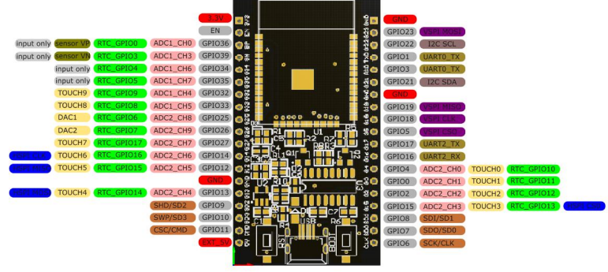


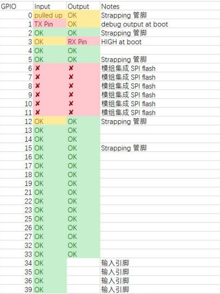


## 2. 开发环境搭建

### 2.1 Thonny软件安装

下载地址：https://thonny.org/

下载完成之后安装即可


### 2.2 CH340驱动安装

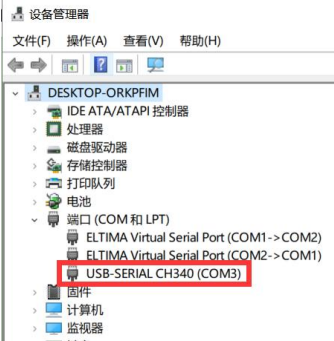


### 2.3 REPL 串口交互调试

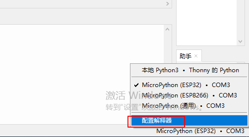

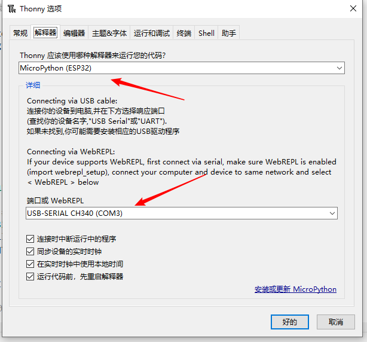

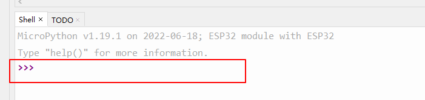


Ctrl + C：打断正在运行的程序

Ctrl + D：软件复位开发板


### 2.4 文件系统

 MicroPython固件内置了文件系统

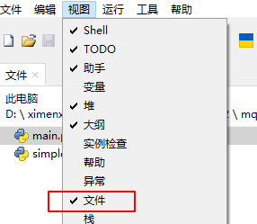

## 3. LED

### 3.1 硬件

LED电路比较简单这里就大概介绍一下，led输出端统一接地，只需要控制IO输出就能控制led的亮灭。

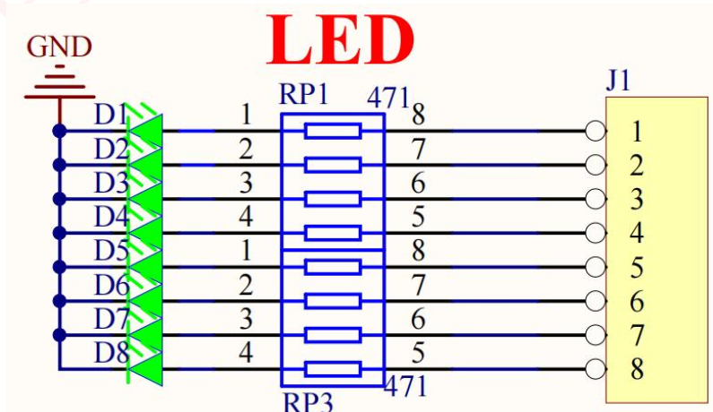


### 3.2 MicroPython 相关函数

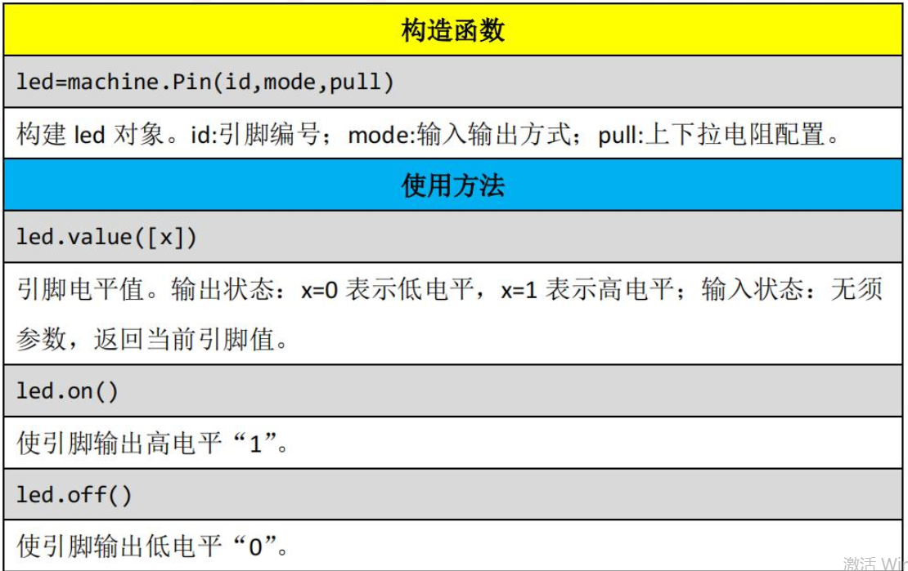


### 3.3 流水灯实验

```python
from machine import Pin
import time

# 流水灯间隔时长
SLEEP_MS = 25

# 定义led元组，八个，led默认关闭
leds = (
    Pin(15, Pin.OUT, Pin.PULL_DOWN),
    Pin(16, Pin.OUT, Pin.PULL_DOWN),
    Pin(17, Pin.OUT, Pin.PULL_DOWN),
    Pin(18, Pin.OUT, Pin.PULL_DOWN),
    Pin(19, Pin.OUT, Pin.PULL_DOWN),
    Pin(21, Pin.OUT, Pin.PULL_DOWN),
    Pin(22, Pin.OUT, Pin.PULL_DOWN),
    Pin(23, Pin.OUT, Pin.PULL_DOWN),

)

while True:
    # 挨个开
    for led in leds:
        led.on() # 设置低电平
        time.sleep_ms(SLEEP_MS)

    # 挨个关
    for led in leds:
        led.off() # 设置高电平
        time.sleep_ms(SLEEP_MS)
```


## 4. 蜂鸣器

### 4.1 硬件

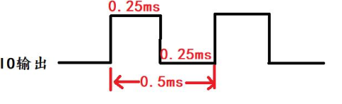

控制IO输出脉冲，控制占空比来使其发生。


### 4.2 蜂鸣器实验

```python
from machine import Pin
import time

# 蜂鸣器实验
beep = Pin(25, Pin.OUT)

if __name__ == '__main__':
    i = 0;
    while True:
        i = not i;
        beep.value(i)
        time.sleep_us(250)
```


## 5. 继电器

### 5.1 继电器简介

继电器是一种电子控制器件，相当于一个开关，接在任意线上，断开状态下线就断开，没导通，闭合状态下线就接在一起，导通。通常使用继电器可实现小电流控制大电流，或者低压控制高压等设备。比如 ESP32 的 GPIO 输出电平是3.3V，要控制 24V 或者 220V 高压设备，可选择继电器。

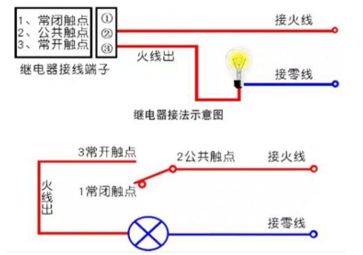

默认情况下，常闭触点和公共触点是导通连接在一起的，当继电器工作后， 公共触点和常闭触点就断开，然后常开触点和公共触点导通连接在一起，这就像开关一样。

### 5.2 硬件

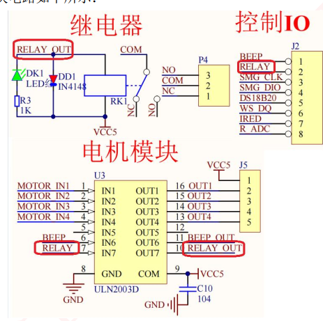


### 5.3 继电器控制LED实验

```python
from machine import Pin
import time

# 继电器实验
jdq = Pin(25, Pin.OUT)

if __name__ == '__main__':
    i = 0;
    while True:
        i = not i;
        jdq.value(i)
        time.sleep(1)
```


## 6. 按键

### 6.1 硬件

按键是一种电子开关，使用时轻轻按开关按钮就可使开关接通，当松开手时, 开关断开。一般机械按键按下和松开时存在抖动情况，如下：

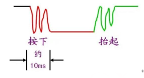

这种抖动可能会影响程序误判，造成严重后果，通常会使用软件延时 10ms 来消斗。例如，当按键按下后，引脚为低电平；所以首先读取引脚电平，若引脚为低电平，则延时 10ms 后再次读取引脚电平，若为低电平，则证明按键已按下。


### 6.2  **MicroPython** 函数使用

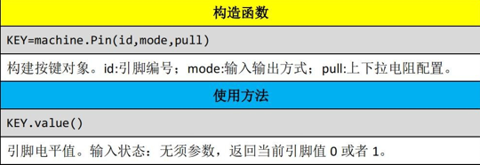


### 6.3 按键控制LED

```python
from machine import Pin
import time

# 按键实验
# 25 IO口设置为上拉输入
key = Pin(25, Pin.IN, Pin.PULL_UP)

# 26 IO口设置为下拉输出
led = Pin(26, Pin.OUT, Pin.PULL_DOWN)

# 全局按键状态，用于不可连续按，默认未按下
press = 0

if __name__ == '__main__':
    led_val = 0;
    while True:
        # 读取key IO口电平
        ley_val = key.value()
        if ley_val == 0 and press == 0:
            press = 1
            time.sleep_ms(10)
            if ley_val == 0:
                led_val = not led_val
                led.value(led_val) 
        elif ley_val == 1: # key释放后，恢复press状态为0，代表未按下
            press = 0
```


## 7. 外部中断

### 7.1 中断简介

虽然能实现 IO 口输入功能，但代码是一直在检测 IO 输入口的变化，因此效率不高，特别是在一些特定的场合，比如某个按键，可能 1 天才按下一次去执行相关功能，这样我们就浪费大量时间来实时检测按键的情况。

为了解决这样的问题，我们引入外部中断概念，顾名思义，就是当按键被按下(产生中断)时，才去执行相关功能。这大大节省了 CPU 的资源，因此中断在实际项目中应用非常普遍。

ESP32 的外部中断有上升沿、下降沿、低电平、高电平触发模式。上升沿和下降沿触发如下：

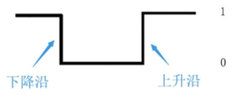

若将按键对应 IO 配置为下降沿触发，当按键按下后即触发中断，然后在中断回调函数内执行对应功能。


### 7.2 MircoPython 函数使用

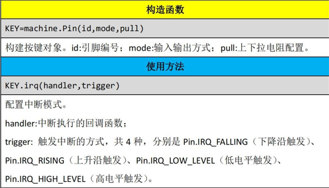


### 7.3 按键触发中断，控制led

```python
from machine import Pin
import time

# 中断实验
# 25 IO口设置为上拉输入
key = Pin(25, Pin.IN, Pin.PULL_UP)


# 26 IO口设置为下拉输出
led = Pin(26, Pin.OUT, Pin.PULL_DOWN)

# 灯状态
led_state = 0

# 中断函数
def key_handler(key1):
    print(key1 == key)
    global led_state
    if key1.value() == 0:
        time.sleep_ms(15)
        if key1.value() == 0:
            led_state = not led_state
            led.value(led_state)

key.irq(key_handler, Pin.IRQ_FALLING)

if __name__ == '__main__':

    while True:
        pass
```


## 8. 定时器

### 8.1 MircoPython 函数使用

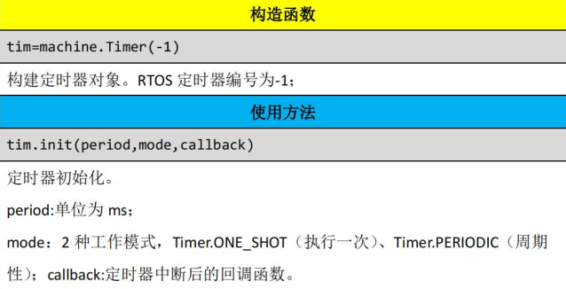

### 8.2 按键触发中断，控制led

```python
from machine import Timer
from machine import Pin


# 定时器实验

# 定时器 0
time_0 = Timer(0)

time_0.init(period= 1000, mode=Timer.PERIODIC, callback= lambda e:print(e))

if __name__ == '__main__':

    while True:
        pass
```


## 9. PWM

### 9.1 简介

PWM 是脉冲宽度调制，简称脉宽调制。它是利用微处理器的数字输出来对模拟电路进行控制的一种非常有效的技术。PWM 主要用于输出不同频率、占空比（一个周期内高电平出现时间占总时间比例）的方波。以实现固定频率或平均电压输出。频率固定，改变占空比可改变输出电压，如下所示：

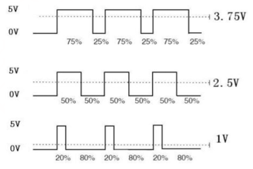


### 9.2  **MicroPython** 函数使用

PWM 可以通过 ESP32 所有 GPIO 引脚输出。所有通道都有 1 个特定的频率， 从 1 到 40M 之间（单位是 Hz）。占空比的值为 0 至 1023 之间。

PWM 在 machine 的 PWM 模块中，我们也是只需要了解其构造对象函数和使用方法即可。

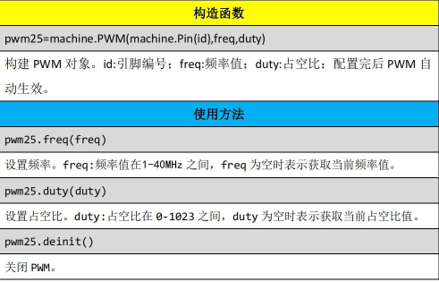

### 9.3 PWM控制LED

```python
from machine import Pin, PWM
import time

# PWM
pwm = PWM(Pin(26))
pwm.freq(4000000)
pwm.duty(0)


if __name__ == '__main__':
    num = 0
    direc = 10
    while True:
        num += direc
        if num > 1023:
            num = 1023
            direc = -10
        elif num < 0:
            num = 0
            direc = 10

        pwm.duty(num)
        time.sleep_ms(10)
```


## 10.  直流电机

### 10.1 简介

直流电机没有正负之分，在两端加上直流电就能工作。开发板配置的直流电机为 5V 直流电机。

要让直流电机旋转，直接使用 ESP32 的 GPIO 连接肯定是不行的，需要借助驱动模块，比如板载的 ULN2003 模块。它可以让 ESP32 的 GPIO 提供很小的电流就能驱动大电流的设备。

ULN2003 使用非常简单，可以简单理解为一个非门，即输入为高电平，输出则为低电平，输入为低电平，输出则为高组态。ULN2003 结构图如下：

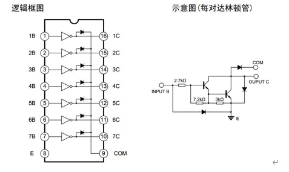

从图中可知，1B 输入对应 1C 输出，2B 输入对应 2C 输出，因此类推。注意： 因为 ULN2003 的输出是集电极开路，ULN2003 要输出高电平，必须在输出口外接上拉电阻。这也就能解释在后面连接直流电机时为什么不能直接将 ULN2003 的 2 个输出口接电机线，而必须一根线接电源，另一个才接 ULN2003 输出口。


### 10.2 硬件设计

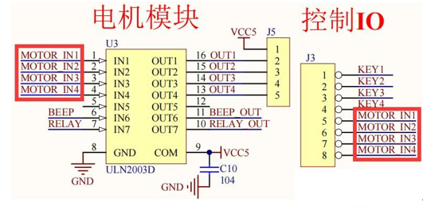

### 10.3 按键控制PWM，最终控制直流电机转速

```python
from machine import Pin, PWM
import time

# PWM
pwm = PWM(Pin(26),freq=1000,duty=0)

# 25 IO口设置为上拉输入
key = Pin(25, Pin.IN, Pin.PULL_UP)

level = (0, 250, 500, 750, 1023)
level_index = 0

pwm.duty(level[level_index])

def key_handler(key1):
    global level_index
    
    if key1.value() == 0:
        time.sleep_ms(15)
        if key1.value() == 0:
            level_index += 1
            print(level_index)

            pwm.duty(level[level_index  % 5])
       
        
key.irq(key_handler, Pin.IRQ_FALLING)

if __name__ == '__main__':

    while True:
        pass

```

使用按键中断来控制直流电机，会存在一个问题，直流电机会将电流消耗掉，导致重复进入中断


## 11. 串口

### 11.1 简介

串口是非常常用的通信接口，有很多工控产品、无线透传模块都是使用串口来收发指令和传输数据，这样用户就可以在无须考虑底层实现原理的前提下将各类串口功能模块灵活应用起来。

ESP32 有三个硬件 UART：UART0、UART1 和 UART2。它们每个都分配有默认的GPIO，如下：

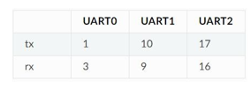

UART0 用于下载和 REPL 调试，UART1 用于模块内部连接 Flash，通常也不使用，因此可以使用 UART2 与外部串口设备通信。


### 11.2 MicroPython 函数

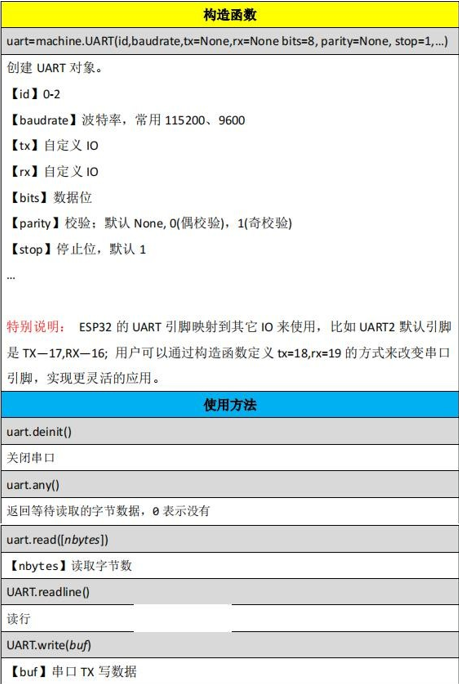


### 11.3 串口电脑通信

```python
from machine import UART
import time

uart = UART(2, 115200, rx = 16, tx = 17 )
# 串口通信
if __name__ == '__main__':
    uart.write("hello world")
    while True:
        val = uart.any()
        if val:
            print(val)
            text = uart.read(128)
            print(text.decode("UTF-8")) # tip：接收中文转码会出错
            uart.write(text)
```


## 12. ADC

### 12.1 ADC简介

ADC（analog to digital converter）即模数转换器，它可以将模拟信号转换为数字信号。由于单片机只能识别二进制数字，所以外界模拟信号常常会通过ADC 转换成其可以识别的数字信息。常见的应用就是将变化的电压转成数字信号。

ADC 功能在 ESP32 引脚 32-39 上可用。请注意，使用默认配置时，ADC 引脚上的输入电压必须介于 0.0v 和 1.0v 之间（任何高于 1.0v 的值都将读为 4095）。如果需要增加测量范围，需要配置衰减器。


### 12.2 MicroPython 函数使用

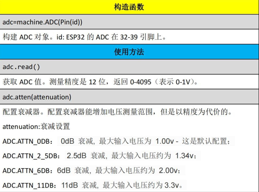


### 12.3 ADC实验

```python
from machine import ADC, Pin, Timer


# ADC
pin_36 = Pin(36)
adc = ADC(pin_36)        # create an ADC object acting on a pin
adc.atten(ADC.ATTN_11DB) # 设置11db,衰减输入（测量电压范围0.0v - 3.3v）


# 定时器 0
time_0 = Timer(0)

def time0_irq(time0):
    adc_vol = 3.3 * adc.read_u16() / 65535
    print("%.2fv" %adc_vol)

time_0.init(period= 1000, mode=Timer.PERIODIC, callback=time0_irq)


if __name__ == '__main__':
    while True:
        pass
```


## 13. DS18B20

```python
from machine import Pin
import ds18x20
import time
import onewire


# DS18B20

ow = onewire.OneWire(Pin(13))

ds18b20 = ds18x20.DS18X20(ow)

if __name__ == '__main__':
    roms = ds18b20.scan()
    print("DS18B20初始化成功")
    while True:
        ds18b20.convert_temp()
        time.sleep(1)
        for rom in roms:
            print("%0.2f" %ds18b20.read_temp(rom) )

```

